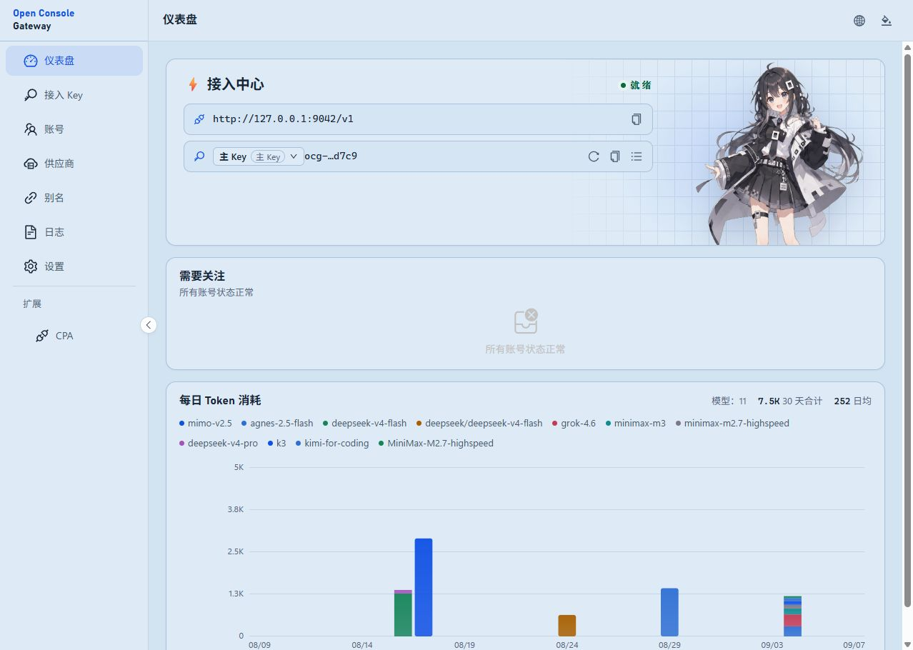

[简体中文](README.zh-CN.md)

# Open Console Gateway

**Bring your AI subscriptions and APIs together.**

Manage your provider accounts in one place and connect them to the desktop apps
and coding tools you already use. Run it on your own machine, with a dashboard
for accounts, usage, and requests.

**[Download](https://github.com/klarkxy/open-console-gateway/releases/latest)** ·
[Get started](docs/user/install.md) · [Docker](docs/user/docker.md) ·
[User guide](docs/USER.md)

Windows · macOS · Linux · Docker

  

## What you can do

- **Keep your accounts together.** Manage subscriptions from multiple providers
  and your own API connections in one dashboard.
- **Give your tools one entry point.** Connect compatible chat apps and coding
  tools, then manage their access with your own Key.
- **Choose which account goes first.** Drag to set priorities. When an account
  hits a rate limit, the gateway can try another compatible account.
- **See where your usage goes.** Check usage estimates, available cost estimates,
  and request logs to understand what's working and what needs attention.

Start with OpenCode Go, Zen Free, Kimi Code CN, MiniMax CN Token Plan, or
Command Code GOAT. You can also add a compatible API service.
[Explore providers](docs/user/providers.md).

## Up and running

1. **Download and launch.** The dashboard opens in your browser.
2. **Add an account.** Choose your provider and enter its credentials when needed.
3. **Connect a tool.** Copy the connection address and **Key** from Connection
   Center into your app, then send your first message.

[Connect your first client](docs/user/first-client.md) ·
[Manual client setup](docs/user/add-application.md) ·
[Run with Docker](docs/user/docker.md)

## Make it yours

[User guide](docs/USER.md) for everyday use. [Architecture gallery](https://klarkxy.github.io/open-console-gateway/)
for a look inside. Want to contribute? Start with the [maintainer guide](docs/MAINTAINER.md),
[report an issue](https://github.com/klarkxy/open-console-gateway/issues), or tell us
what you'd like to connect next.

Join the QQ group: **1104321231**. If OCG makes your setup easier, our mascot
would appreciate a Star.

QQ group QR code

  

Thanks to our [contributors](docs/CONTRIBUTORS.md). [License](LICENSE).

## Star History

<a href="https://www.star-history.com/?type=date&repos=klarkxy%2Fopen-console-gateway">
 <picture>
   <source media="(prefers-color-scheme: dark)" srcset="https://api.star-history.com/chart?repos=klarkxy/open-console-gateway&type=date&theme=dark&legend=top-left&sealed_token=oIYrocSP1u8BIlRFlVg34QKt9W7GAzchQqPbmV-cwy6F84-IJx1RTsYIEG0UYpaFcFPiCY24bdJgYhkONvQgjsIQzgRLf_YXiP7W9BzlHU9rMGGb68O2Tg" />
   <source media="(prefers-color-scheme: light)" srcset="https://api.star-history.com/chart?repos=klarkxy/open-console-gateway&type=date&legend=top-left&sealed_token=oIYrocSP1u8BIlRFlVg34QKt9W7GAzchQqPbmV-cwy6F84-IJx1RTsYIEG0UYpaFcFPiCY24bdJgYhkONvQgjsIQzgRLf_YXiP7W9BzlHU9rMGGb68O2Tg" />
   
 </picture>
</a>
