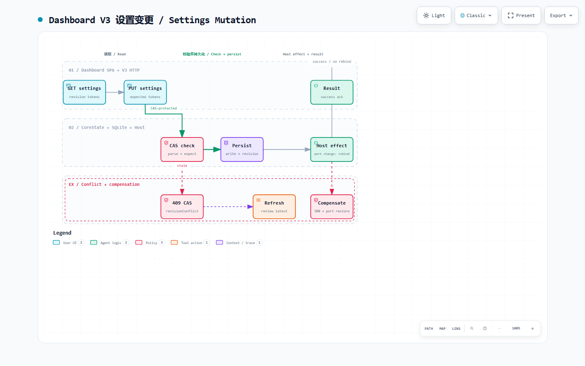

[简体中文](dashboard-api.zh-CN.md)

# Dashboard API

## Dashboard V3

Dashboard JSON is `/dashboard/api/v3`. DTOs are camelCase, mutation bodies deny unknown fields, and nullable response fields serialize as `T | null`.

Control-plane identity:

- `settings_revision` — in-memory `AtomicU64` on `CoreState`, bumped after
  a successful persist. Not stored in SQLite as the CAS token.
- `process_generation` — assigned once per `CoreState`, never persisted.
  A CAS token from a previous process cannot be reused after restart.
- `pricingRevision` — immutable snapshot id. Pricing mutations also send
  `expectedPricingRevision`.

Mutations require top-level `expectedRevision` and `processGeneration`
(including `/auth/register`, `/auth/login`, `/auth/logout`, and
`POST /accounts/{id}/usage/refresh`). A missing `expectedRevision` returns
`400` `missingExpectedRevision`; a mismatch returns `409` `revisionConflict`
with `currentRevision` and `processGeneration` in the error envelope. The Vue
`controlPlane` store records both tokens from every V3 payload. On 409 the
client refreshes the control tokens and affected resource without replaying
the mutation; the user can review current state and submit again. Tokens are process-local
and do not coordinate separate processes sharing a data directory.

Operations that are not mutations skip CAS and never bump revision:
operational diagnostics such as `POST /settings/test-proxy` and
`POST /custom/models/discover`; update checks such as
`GET /settings/check-update` and `GET /settings/update-status` capture tokens
without bumping. `POST /settings/install-update` requires CAS and starts
atomically, but does not bump and holds no network or DB lock.

Plaintext keys never appear on `Settings`, provider, Zen, or contract DTOs.
`ConnectionInfo` (`GET /connection`) is the only secret-bearing V3 response:
it returns the primary key and every non-deleted sub-key value, including
disabled sub-keys, under dashboard session protection. Only enabled keys enter
the authentication snapshot. `CustomModelDiscoveryRequest.apiKey` is write-only.
Account list/get payloads stay secret-free. Logs and error envelopes redact
known secrets.

The frozen contract is `schema/dashboard-api-v3.schema.json`, generated from
`dashboard_v3::contract_schema_pretty()` by
`crates/ocg-core/examples/export_dashboard_v3_schema.rs`. Generated TypeScript
(`src/api/generated/dashboard-v3.ts`) is types only, with no HTTP wrappers.
`CATALOG_TYPE_NAMES` in `dashboard_v3/types.rs` is the ordered `$defs` catalog;
appending must keep existing definitions byte-identical.

Pinia stores call `dashboardV3` directly. Pages that still use older field names
go through `src/api/dashboard.ts` presenters. Do not add V2 imports, route
fallbacks, or recursive case conversion.

`dashboard.rs` serves the SPA and preserves the V2 auth and browser WebSocket
handlers. Retired `/dashboard/api/...` REST paths are tombstoned in
`host_router` before they reach `dashboard.rs`.

## Settings mutation workflow

[Open the interactive diagram on GitHub Pages](https://klarkxy.github.io/opencode-go-mgr/diagrams/dashboard-v3-mutation/).

This sequence is specific to CAS-protected Settings writes; discovery,
diagnostic, and read operations may skip CAS as described above. The client
submits `expectedRevision` and `processGeneration`. A mismatch returns `409`;
the client refreshes the tokens and affected resource, but does not replay the
write automatically.

After CAS succeeds, the Host persists the new settings and releases the
settings lock. It rebinds the listener only when the port changed and a
listener is running. If rebind fails, the request returns `500` with code
`internal`. Compensation restores the previous port only when the live config
still contains the failed committed port, so a later successful write is not
overwritten.

## Retired V2 REST

Protected Dashboard V2 REST is retired.

- Anonymous retired REST: empty-body **401** (auth runs before the
  tombstone).
- Authenticated retired REST (including loopback local mode): **410** with
  `{ "code": "dashboardV2Removed", "message": "Dashboard API V2 has been removed; refresh the page and retry." }`.
- Unknown `/dashboard/api/...` paths that are not V3 and not a preserved
  family are also 410 once authenticated.

Preserved `/dashboard/api` families (exact path, no trailing slash, no
extra segments):

- `auth/status`, `auth/register`, `auth/login`, `auth/logout`
- `browser/sessions/{token}/ws` (non-empty token)

V3 auth and browser WebSocket live under `/dashboard/api/v3/...`; the Vue
shell uses them. Inference routes, dashboard HTML, and `/dashboard/assets/...`
are outside the tombstone.

---

[Maintainer guide index](../MAINTAINER.md) · [简体中文](dashboard-api.zh-CN.md) · [Docs index](../README.md)
