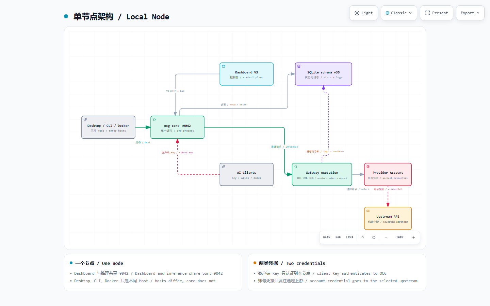

[简体中文](architecture.zh-CN.md)

# Architecture

OCG Manager is one local node. Desktop, CLI, and Docker are alternative hosts
for the same `ocg-core` process; they do not create separate control planes.
The default listener is `127.0.0.1:9042`, with no remote sync, Admin API, or
telemetry.

## One local node

[Open the interactive diagram on GitHub Pages](https://klarkxy.github.io/opencode-go-mgr/diagrams/local-node/) to switch themes,
trace relationships, or export another format.

The Dashboard and inference endpoints share port `9042`, but they use different
credentials. A client **Key** authenticates an AI tool to OCG Manager. After
selection, the account credential is sent only to that account's configured
upstream; Zen Free has no credential. The Vue SPA talks HTTP Dashboard V3 and
does not use a Tauri `invoke` data path.

## Request lifecycle

One inference request follows a fixed order:

1. Authenticate the client **Key** from `access_keys`.
2. Parse the client protocol and resolve an Alias, exact built-in raw ID,
   user-defined Provider public model, or eligible Custom model ID.
3. Materialize compatible accounts, then apply card order and the selected
   strict-priority, global-sticky, or round-robin policy.
4. Build one sealed adapter attempt, resolve that account's credential, and
   send one upstream request. The request path never probes a protocol.
5. Convert the response or SSE stream back to the client format, then record
   request identity, upstream identity, usage, and cooldown state.

Unknown model names return `400`. Ambiguous exact raw IDs return
`ambiguous_model_id` without an upstream call. Account fallback may continue
after eligible pre-send or provider-specific failures; ambiguous or unsafe
requests fail before selection.

## Product ownership

| Surface | Owns | Does not own |
| --- | --- | --- |
| **Access Keys** | Client-facing primary and sub Keys | Upstream account credentials |
| **Accounts** | Account Key, enablement, order, notes, cooldown, usage state | Provider catalogs or shared protocol contracts |
| **Providers** | Built-in catalogs, model/protocol contracts, pricing scopes, typed user-defined Provider Endpoint/auth/mappings | Custom API account mappings |
| **Custom API account** | One API URL, one account-wide upstream protocol, public-model → upstream-ID mappings | Dynamic adapter code or shared Provider definitions |
| **Extensions / CPA** | One approved local external-integration boundary | General plugins or arbitrary remote process control |
| **Applications** | Client guides and optional local Desktop connectors | A second Gateway or remote configuration service |

The Adapter Registry is static and sealed. User-defined Providers persist as
typed data and always bind Configurable HTTP. OCG Manager never loads user
scripts, adapter plugins, or binaries.

## Local model lists

These reads use local state and never perform request-time upstream discovery.
Catalog refreshes are explicit actions on **Providers**.

| Endpoint | Published models |
| --- | --- |
| Authenticated `GET /v1/models` | Currently routeable code-owned Aliases, saved Zen/Command/CN mappings, saved user-defined Provider public models, and eligible Custom declared IDs |
| `GET /dashboard/api/v3/application-models` | Go-routeable Aliases intersected with the current Go pricing snapshot; excludes Custom API, user-defined Providers, and CN Plans |
| `GET /claude-desktop/v1/models` | The three Claude Desktop role aliases only |

Saved catalog rows do not invent new built-in Aliases. Unknown rows remain
exact raw pins until code assigns an Alias, and a Custom ID cannot take over an
already published built-in Alias.

## Protocol conversion

Clients may use OpenAI Chat Completions, OpenAI Responses, Anthropic Messages,
Gemini `generateContent` / `streamGenerateContent`, or Claude Desktop entry
points. A supported and enabled client/upstream pair passes through; otherwise
the whole request and response are converted to and from the model's effective
upstream protocol. Gemini is a client format only—OCG Manager does not send the
request to Google.

The complete preferred/supported matrix and conversion limits live in
[Protocol conversion](protocol-conversion.md).

## Where to read next

| Task | Guide |
| --- | --- |
| Install and connect a client | [Install](install.md), [First client](first-client.md) |
| Add and order accounts | [Accounts](accounts.md), [Routing](routing.md) |
| Manage catalogs and contracts | [Providers](providers.md) |
| Understand aliases and errors | [Gateway](gateway.md) |
| Inspect the crate and Host boundaries | [Maintainer architecture](../maintainer/architecture.md) |

---

[User guide index](../USER.md) · [简体中文](architecture.zh-CN.md) · [Docs index](../README.md)
